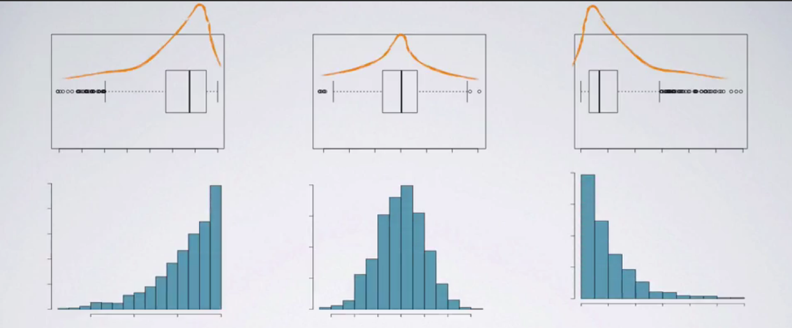

# Exploring Data

One of the min jobs of statistics is the one of exploring data, 
techniqus to explore data are different depending on the nature (i.e., type) of
the data. 

## Exploring Numerical Data

Let's see some of the techniques used to explore numerical data.

### Visualizing Numerical Data

#### Scatterplot
A common tool to visualize relationship between two numerical variables is the
**scatterplot**, generally on the scatterplot we have the explanatory variable
on the x axis, and the response variable on the y axis. 

As we may remind, the explanatory variable is the variable responsible for
affecting the response variable in our analysis.

If we think that the wealth of a city control the life expectancy, then our
explanatory variable is the wealth of city, while the response is the life
expectancy.

Once we have a scatter plot, we generally draw a curve which fits most of the
points, or summarizes the set of points.

Scatterplots also help us in ientifying the outliers, so data points which are
significantly different from the other data points, we will come back on this in
a later section.

When considering relationship between two numerical variables we generally
consider:

*   Direction: either positive or negative
*   Shape: linear or curved
*   Strength: strong (with not too much scatter) or weak (with a lot of scatter)
*   Outliers

A naive approch to deal with outliers is to just remove them, but actually there
are more effective ways to deal with them, we will see in other sections.

#### Histogram

The histogram is a way to visualize the distribution of a numerical variable.
In a histogram, data are binned into intervals and the height of the bars
represent the number of cases that fall into each interval.

So in other words histograms:

* provide a view of data density, higher bars are the more common cases
* very very useful for describing the shape of the distribution


Things we look in an histogram are:

*   Skewness
*   Modality

We should note that the bin width of the histograms can alter the story the
histogram is telling us. A bin width which is too high, can make us lose a lot
of information about data, while if a bin width is too small it might b
difficult to get an overall picture of the data, so we should play with the bin
width to have an histogram which satisfies us.

##### Skewness
What we can see in an histogram is the **skewness**, so a distribution can be:

* Left Skewed: if its tail goes from right to left decreasing, so the tail is
  on the left
* Right Skewed: if its tail goes from left to right decreasing, so the tail is
  on the right
* Symmetric: if the peak is at the center more or less

##### Modality

A distribution might be:

* Unimodal: a single peak, the bell curve or normal distribution is unimodal
* Bimodal: two peaks, this might indicate that there are two different
    distributions in our data
* Uniform: no significant peaks, or all the beans are peaks, no apparent trend
    in the data
* Multimodal: more than two peaks

Anyway identifying modes in a distribution is not an exact science, but we
generally are just interested in understand if our distribution is unimodal or
uniform or something else.

#### Dotplot

A dotplot is very similar to a histogram, anyway if the sample size becomes too
big it can become an inconvenient representation of the data.

#### Box plot

Another technique for visualizing data is the box plot, this technique is
extremely useful for identifying outliers.

The box plot also shows us the median (which is a thick line inside the box) and
the IQR (InterQuartile Range) which is the width of the box.

Notice that box plots do not show modality of a distribution.

One way for determining the skewness of a distribution from a boxplot is to see
where the median is. So if the median is at the center of the box, then we may
have a symmetric distribution, while if the median is more toward the left we
have a right skewed distribution, and so on.



#### Intensity Map
This can be useful to highlight spatial distribution, so coloring a map with
different colors depending on the values per map region.

For example if we want to highlight the amount of hospitals per region in italy,
we could have a map of italy with differing colors, e.g., redder regions will be
regions with less hospitals, while bluer regions will be regions with more
hospitals.

Intensity maps may reveal trend in the data that other visualization techniques
do not show.

### Measures of Center

Now we will see methods for quantifying centers of numerical distributions.

Quantities representing the centrality of data are:

* Skewness
* Modality
* Mean (which is the arithmetic average)
* Median (midpoint of the distribution, or 50th percentile), we just order data
    and then get the central value, so we can say that 50% of the population is
    below or equal to that value
* Mode (most frequent observation), not very useful for numerical data
* Midrange (this is rarely used) it is basically an average with only max and
    min values, this is used for example with temperatures

N.B.: if the number of data points is even, in order to compute the mode, e just
take the average of the two central values.

If these measures are computed from a sample, they are called **sample
statistics**.

Sample statistics are **point estimate** for unknown population parameters.

We generally use letters from the latin alphabet when denoting sample statistics
and letters from the greek alphabet when denoting population statistics.


Notice that for what concerns the mean, in right skewed distribbutions, the mean
is shifted to the right with respect to the median, and the same happens with
left skewed distributions, where the mean is shifted on the left with respect to
the median.
In symmetric distributions, the mean and the median are roughly equal to each
other.
Observation: In a left skewed distribution, less than 50% of the data are below
the mean.

N.B.: In general we use as measure of center the mean if a set of data points
is symmetric, while if their distribution is skewed, then a more reliable
measure of center is the median.


### Measures of Spread

In statistics in order to talk about the variability of data, we talk about
spread of data.
There are different quantities to measure the spread, some of these are:

* range (max - min), this is informative but not very reliable for spread of
    data
* variance, this is roughly th average squared deviation from the mean
* standard deviation, this is the square root of the variance
* interquartile range

#### Variance

This is roughly th average squared deviation from the mean:
$ s^2 = \frac{\sum{i=1}{n}(x_i - \bar{x})^2}{n -1} $ 

So we square the difference of data with respect to the mean and this is done to
get rid of negatives so that negatives and positives don't cancel each other
when added together.
Anyway we could also use the absolute value, so why bothering with a square?
Well actually square values tend to amplify large differences more than small
deviations. So larger deviations will have a larger weight.

N.B.: Sample variance is indicated with $s^2$ while population variance is
denoted with $\sigma^2$


#### Standard Deviation

Anyway, although variance is interesting, at the end of the day we still prefer
a spread measure which has the same units of measure of our original data, so
that's why we introduce the concept of standard deviation, which is simply the
square root of the variance.

So this is roughly the average deviation around the mean, and has the same units
as the data.


N.B.: Sample stddev is indicated with $s$ while population stddev is
denoted with $\sigma$

#### InterQuartile Range (IQR)

This is another measure for spread of data, and it represents the range of the
middle 50% of the data, so the distance between the first quartile (25th
percentile)a and third quartile (75th percentile).

So IQR = Q3 - Q1

where Q3 is the third quartile and Q1 is the first quartile.

IQR is evident in a box plot.


### Robust Statistics

We can define as **robust statistics** the measures on which extreme
observations have little effect.

For example if we consider the measure of centrality and of spread we can say
that the median is a more robust statistic with respect to the mean, since
outliers have less effect on the median, while for the spread IQR is a robust
statistic with respect to the standard deviation and the range, also in this
case because outliers have less effect on IQR.

Robust statistics are more useful for describing skewed distributions or data
with extreme observations.

Non robust statistics like mean and stddev are useful for describing symmetric
distributions.

### Transformation of Data

Transformation of data is a rescaling operation performed on data using a
function. 
This is done in order to make data easier to model.

We generally want to transform data when it is strongly skewed, so that it can
become easier to model.

Let's see some common transformations:

*   Natural Log Transformation: this is often applied when most of the data
    cluster near zero (relative to the larger values in the data set) and all
    the observations are positive
*   Square Root Transformation, to make values closer to each other, or on a
    similar scale
*   Inverse Transformation, to reverse a relationship to make it linear

Log transformations can also be applied on scatter plots (to one or both 
variables) to make the relationship between variables more linear and then
easier to model with simple methods.


Notice that the transformation of data, although being useful, can commplicate
the interpretation of data.

So to recap, we generally want to transform data for the following reasons:

* see data structure differently
* reduce skew, and make modeling of data easier
* straighten a nonlinear relationship in a scatterplot


## Exploring Categorical Data

Common ways to represent categorical variables are:

* Frequency tables: so a table representing for each category its frequency in 
  the dataset
* Bar Plots: it is a plot describing with a bar the frequency for each category
  of categorical variable, generally we can plot:
    * Absolute Bar Plots: reporting the absolute frequencies
    * Relative Bar Plots: reporting the relative frequency (aka percentages)

Bar plots can look like histograms, but they are significantly different since:

* Bar plots are used for categorical variables, while histograms for numerical
    variables
* The x axis on a histogram is a number line, and the ordering of the bars are
    not interchangeable

Another way to describe categorical variable is the pie chart, but this is less
informative than a bar plot, this is because if there are many categories for a
categorical variable, it can become difficult to understand which is more
frequent.

So if we can choose, generally a bar plot is better.


### Contingency Tables

This is another tool used to describe the relationship between two categorical
variables or between a categorical variable and a discrete (or discretized) 
numerical variable.

Contingency table are tables used to compare variables, and generally contain
absolute frequencies but we can just take each cell and divide it by the last
row values and obtain a relative percentage value

We generally Use contingency tables and segmented bar plots or mosaic plots 
to assess the relationship between two categorical variables.

35/290 ≈ 12% of Republicans, 146/341 ≈ 43% of Democrats, and 69/341 ≈ 20% of
Independents think that teachers belonging to unions or bargaining associations
helped the quality of public school education in the United States. Since there
is considerable differences between these proportions, the results of the survey
suggest a relationship between opinion on teachers belonging to unions or
bargaining associations and political party affiliation.


### Bar Plot Variations

There are some useful variations on the classical bar plot which are useful
when we have to compare two categorical variables:

* Segmented (or stacked) Bar Plot, which is a bar plot which uses different
    colors for different classes
* Relative Frequency Segmeneted Bar Plot, which gives all the bars the same
    height and on the y axis we just have a percentage value and the bars are
    colored, so we can explore the relative percentage for each category
* Mosaic Plot, where this time, the width of the bar represents the frequency of
    one of the categorical variables while the height for each color represents
    the relative frequency for the other categorical variable

### Comparing a Categorical variable with a Numerical Variable

In order to make a comparison between these two types of variables we generally
use a **side-by-side box plot** where on the x axus we put the different
categories and on the y axis we have the values, at this point the boxplots will
represent the numerical distributions.

We can also find side-by-side box plots reversed, so having on the y axis the
categories and on the x axis the distribution values, so the boxes will be
flipped by 90 degrees in this case.


## A taste of Inference

Inferential statistics is in general used to make inferences about a population
just starting from a sample taken from that population.

In inferential statistics as we will see, we will often work with statistical
test. These procedures are also called "hypothesis testing" and in this
framework we:
    * Start with a **null hypothesis** $$ \(H_0\) $$ that represents 
        the status quo, or more in general, states most of the times,
        that there are no differences, in what we are studying, analyzing
    * Set an **alternative hypothesis** $$ \(H_A\) $$ that represents the 
        research question, that we are testing for, or most of the times,
        that there is a difference between the things that we are analyzing

We conduct the hypothesis test (from now on HT) under the assumption that the
null hypothesis is true, either via simulation or theoritical methods.

If the collected data with the test results suggest that the data do not provide
convincin evidence for the alternative hypothesis, we should stick with the null
hypothesis.

If the test data provides convincing evidence, we reject the nul hypothesis in
favor of the alternative hypothesis.

If we conduct an experiment we generally search for some sort of difference in
our sample, something that is done, is generally to build a distribution related
to the differences we find in our samples, from this distribution, the null
hypothesis represents the `zero`, remember indeed that the null hypothesis
generally represents the fact that there are no differences.


So to recap, hypothesis testing is generally performed as follows:

* Set a null and an alternative hypothesis
* simulate the experiment assuming that the null hypothesis is true
* evaluate the probability of observing an outcome at least as extreme as the
    one observed in the original data
* and if this probability is low, we reject the null hypothesis in favor of the
    alternative

The probability of observing data at least as extreme as the one observed in the
original study under the assumption that the null hypothesis is true, is called
the p-value.

The **p-value** is one of the criteria used when making decisions between competing
hypothesis.


### Exercise:  Example of Inferential Study

In 1948, Austin Bradford Hill, designed a study to test a new treatment for
tuberculosis that at the beginning of the study there was no evidence whether it
would be any better or worse than bed rest. He randomly assigned some patients
who volunteered to be a part of this study to receive the treatment
Streptomycin, an antibiotic. The other patients received only bed rest as the
control group. Hill then observed the patients’ outcomes: which patients died
and which recovered. The results of the study are shown below.

This is the contingency table:

```table
        Died    Recovered   Total
Control  14       38        52
Strepto   4       51        55
-----------------------------------
Total    18       89       107
```


We use the following simulation test if there is a difference between the
recovery rates under the two treatments: We write “died” on 18 index cards and
“survived” on 89 index cards to indicate whether or not a patient died. Next, we
shuffle the cards and deal them into two groups of 52 and 55, for control and
treatment, respectively. We then calculate the simulated difference between the
recovery rates in Streptomycin and control groups (p̂Streptomycin − p̂Control),
and record this value. We repeat this simulation 100 times. The histogram below
shows the distribution simulated difference between the recovery rates in these
100 simulations. 

The distirbution seems gaussian with tails ending at 0.2 and -0.2.


SOLUTION

Note that an observed difference in sample statistics suggesting dependence
between variables may be due to random chance, and that we need to use
hypothesis testing to determine if this difference is too large to be attributed
to random chance. Set up null and alternative hypotheses for testing for
independence between variables, and evaluate the data support for these
hypotheses using a simulation technique.

The alternative hypothesis should be that there is a difference between the
recovery rates under the two treatments.

The observed difference between the recovery rates is 

```
p_strepto - p_control = 51/55 - 38/52 = 0.93 - 0.73 = 0.20
```

There is 1 simulation where the simulated difference is ≥0.20\ge 0.20≥0.20,
and since we're doing a two sided hypothesis test, the p-value is
0.01×2=0.02.

