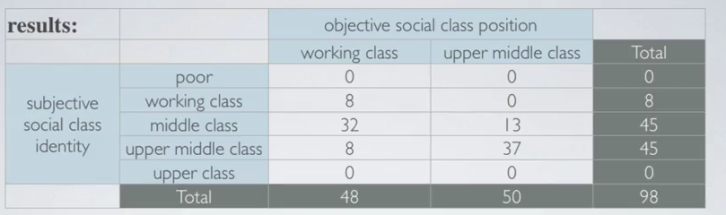
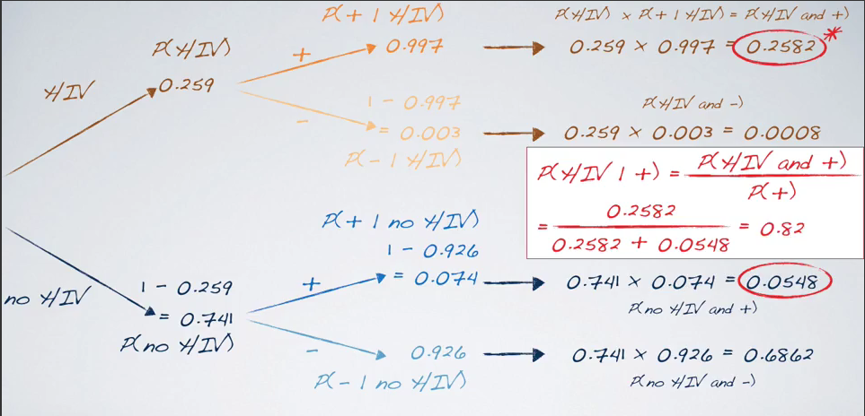

# Probability

## Defining Probability

Let's give some definitions which will build our framework of knowledge.

A **random process**, is a process where we know what outcomes could happen
but we do not know which particular outcome will happen.

Examples of random processes are:
    * Throwing a dice
    * Throwing a coin
    * Waiting for a song in our playlist
    * Stock market prices

It has to be noticed, that sometimes it is useful to model a process as random
although it is not completely random.

-- INSERT IMAD NOTES --

#### Probability definitions
A **frequentist definition** of probability is that, a probability is the proportion
of times the outcome wowuld occur if we observed the random process an infinite
number of times.

A **bayesian definition** of probability is that, a probability is a subjective
degree of belief. This is largely popularized by revolutionary advance in
computational technology and methods during the last twenty years.
This interpretation allows for prior information to be integrated into the
inferential framework.

#### Law of Large Numbers
The **law of large numbers** states that as more observations are collected, the
proportion of occurrences with a particular outcome converges to the probability
of that outcome.

#### Gambler's Fallacy
Consider that if we have a chain of 10 heads, what is the probability of having
again head? It is still 50%, but some people think that the probability of
getting a tail is higher, this is known as the **gambler's fallacy**.

#### Some other definitions

* **Disjoint Events**, are events who cannot happen at the same time, they are also
    said to be mutually exclusive, like passing and being failed at the same
    time in an exam, it just can't happen
* **General Addition Rule**:
    P(A or B) = P(A) + P(B) - P(A and B)
* **Sample Space**, the sample space is a collection of all possible outcomes of a
    trial. Example, a couple has two kids, what is the sample space for the sex
    of these kids? S={MM,FF,FM,MF}
* A **probability distribution** lists all possible outcomes in the sample space,
    and the probabilities with which they occur. A probability distribution must
    satisfy certain rules:
    1. The events listed must be disjoint
    2. Each probability must be between 0 and 1
    3. The probabilities must sum to 1
    So we want to be sure all the sample space is represented in our
    proabability distribution
* **Complementary events**, these are a set of mutually exclusive events whose
    probabilities sum up to 1
* **Independence**, two events are said to be independent if knowing the outcome
    of one does not give useful information on the outcome of the other
    Mathematically if $P(A|B) = P(A)$ then we can say that the events are
    independent. The rule of product for independent events states that if two
    events are independent then we may multiply their probability if we want to
    compute the probability of both happening

##### Side Note: Disjoint vs Independent

Some people keep confusing disjoint events and independent events.
Let's stress the differences:
Disjoint just means that thy are mutually exclusive, so if one is happening at a
time $x$ the other one cannot happen at the same time $x$.
Independent means just the the outcome of an event does not change of influence
or give me any useful information about the outcome of another event.
To make an example launching a single fair coin, and getting head is a dependent
event with respect to have tail and the two events are disjoint.

### Conditional, Marginal and Joint Probabilities

Conditional Probability of an event A given that B has happened or is a known
fact is denoted with $P(A|B)$.
While a joint probability takes into account the probability of two events
happening, without knowning any outcome and is denoted with $P(A,B)$.

A marginal probability is just $P(A)$ or $P(B)$

Contingency tables help us a lot when we have to understand the difference
between these two values.

- Marginal Probability
From this table if we want to compute what is the marginal probability that a
student's objective social class position is upper middle class we just get tht
variable total and divide it by the grand total, so it is 50/98.
- Joint Probability
From this table, what if we want to compute the probability that a student's
objective position and subjective identity are both upper middle class?
We just take the intersection between the rows and then divide it by the grand
total, i.e., 37/98.
- Conditional Probability
Now hat if we want the probability that a student who is objectively in the
working class associates with upper middle class? We divide the intersection of
the two lines, by the total of the variable which now represents a given fact,
i.e., 8/48.

We have to keep in mind the relationship between joint, marginal and conditional
probabilities, namely **The Bayes Theorem** which states:

$P(A|B) = P(A,B)/P(B)$

When working with problems involving bayes theorem or in general probabilities
in a structured manner, it is useful to build probability trees.

Let's see an example of problem:
As of 2009, Swaziland had the highest HIV prevalence in the world. 25.9% of the
country's population is infected with HIV. The ELISA test is one of the first
and most accurate tests for HIV. For those who carry HIV, the ELISA test is
99.7% accurate. For those who do not carry HIV, the test is 92.6% accurate. If
an individual from Swaziland has tested positive, what is the probability that
he carries HIV?
Solution:
We want to compute in practice P(Positive | HIV), in order to do this,
probability trees really come in help as shown in the below figure.

In conclusion, calculating probabilities can be hard, sometimes we add them,
sometimes we multiply them, and sometimes it is hard to figure out what to do ...
tree diagrams really help us when dealing with these problems.

###  Bayesian Inference

To explain bayesian inference, let's take an example.

We have two dices in two hands, one dice is 12-sided and the other one is
6-sided, we don't know which hand holds which dice, and we have to guess this.
The only information we have is if the outcome of the rolled dice is greater or
equal to 4 or not.

Notice that with a 6-sided dice, the probability of getting an outcome >=4 is .5
while with a 12-sided dice the probability is 3/4.

Now depending on the outcome, we should be able to understand which hand holds
the 12-sided dice.
Let's also say that we can collect more data, but every other round will cost us
money.
(Although this is a made up game, this is similar to reality, where data
collection has a cost and may be expensive)

Before collecting data, we don't know if the 12-sided dice is on the left or
right hand, so our assumption is that they are equally probable, this is called
"prior distribution" and gives us prior probabilities.
So although this can be subjective, we say 50% the 12-sided dice is in the right
hand and 50% is in the left hand. These probabilities represent what we believe
before seeing any data.
A different scenario is for example, if I knew that the person launching dices
has a preference on left hand, we could unbalance these probabilities by
assigning a higher value to the left hand.

Now let-s say that H1 (hypothesis 1) is related to having the dice on the right
hand, and that H2 (hypothesis 2) is related to having the good dice on the left
hand. If the outcome is >=4 and we selected the right hand we should update our 
prior probabilities, and the probability that the good dice is on the right hand
should increase.

Now that we know the outcome and we have established a prior probability we can
attempt at estimating the probability of having the 12-sided dice on the right
hand given that the outcome is >=4.
In order to compute all the probabilities we should use Probability Trees.
We want $P(H1: good die on the righthand | rolled >=4 with the die on the right)$
this probability is equal to P(good right, >=4)/ P(>=4)
The result is 0.6 percent.
This probability just calculated is also called "posterior probability", this
probability is:
* generally defined as P(Hypothesis|Data)
* It tells us the probability of a hypothesis we set forth, fiven the data we
    just observed
* It depends on both the prior probability we set and the observed data

So in bayesian approach (or statistics) we evaluate claims iteratively as we
collect more data and at the next iteration or data collection we get to take
advantage of what we learned from data. In other words we update our prior
probabilities from the previous iteration.

To recap:
* We take advantage of prior information, like a previously published study or a
    physical model
* We naturally integrate data as we collect it, and updatee our priors
* Avoid the counter intuitive definition of a p-value:
    P(observed or more extreme outcome | H0 is true)
    where H0 is the null hypothesis
* Instead base decisions on the posterior probability which is
    P(hypothesis is true | observed data)
* A good prior helps, a bad prior hurts, but the prior matters less the more
    data we collect
* More advanced Byaesian techniques offer flexibility not present in Frequentist
    models

